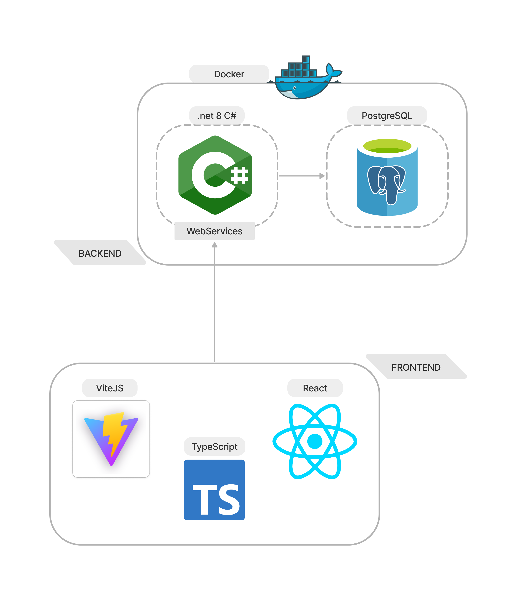

# Solution

Notre plateforme est conçue avec une architecture en deux parties distinctes pour répondre efficacement aux besoins de ses utilisateurs.

Nous avons tout d’abord la partie backend, qui constitue le coeur fonctionnel de la plateforme, il est responsable du traitement des données, de la logique métier et de la gestion des fonctionnalités principales de la plateforme. Cette composante offre une interface sous forme de web-services.

La deuxième partie est le frontend, qui agit comme une interface utilisateur intuitive et conviviale. Cette composante consomme les web-services fournis par le backend et les présente de manière interactive aux utilisateurs finaux.

En combinant ces deux parties, notre plateforme offre une solution complète et intégrée pour répondre aux besoins des utilisateurs.

Avantages 

- Séparation des responsabilités 
- Réutilisabilité du backend 
- Indépendance dans le choix des technologies 

Inconvénients 

- Complexité accrue 
- Sécurité plus complexe 

