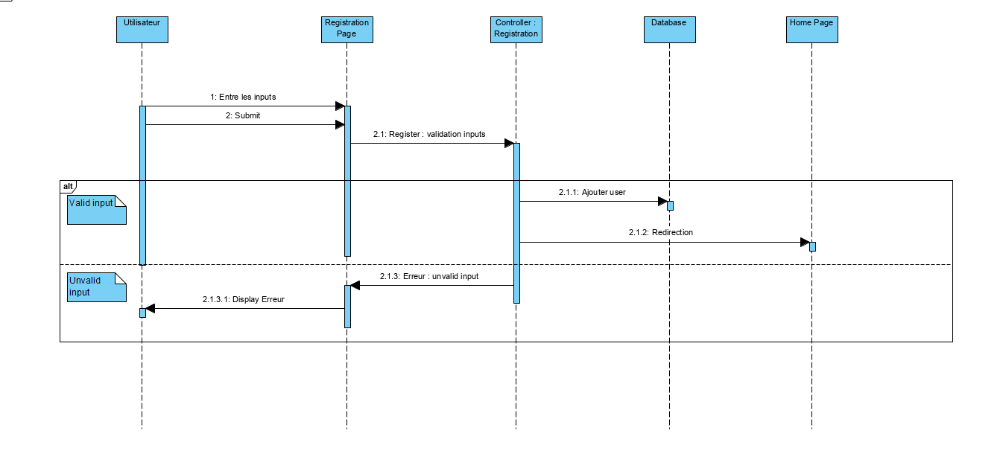

# US01 - Créer un utilisateur

En tant que futur utilisateur de la plateforme, je souhaite m'enregistrer.

## Statut - DONE ✔️

## Description

Les utilisateurs potentiels de la plateforme doivent pouvoir s'inscrire en spécifiant l'organisation à laquelle ils appartiennent.
Concernant l'organisation et le rôle de la personne, deux cas sont possibles :

- L'utilisateur veut rejoindre une organisation existante : il la sélectionne sur la page d'inscription et n'aura pas de rôle
- L'utilisateur veut créer une nouvelle organisation : il la crée lors de son inscription et aura le rôle "gestionnaire"

## Prérequis

- L'utilisateur n'est pas connu dans le système
- Si l'utilisateur veut rejoindre une organisation, elle doit exister dans le système

## Critère d'acceptation

- L'utilisateur est visible dans le système
- L'utilisateur ne peux pas encore se loguer, son compte doit d'abord être validé ([US05 - Validate member](./us-05-validate-member.md))
- On ne peut pas créer un utilisateur avec la même adresse email
- Si l'utilisateur à créé une organisation :
	- Le compte est en attente de validation par l'admin de la plateforme
	- L'organisation est en attente de validation par l'admin de la plateforme
- Si l'utilisateur à rejoint une organisation :
	- Le compte est en attente de validation par le gestionnaire de l'organisation

## Interface utilisateur

TODO

## Web Service

`POST /api/auth/signup`

Request Body
```
- First name
- Last name
- Password
- Email
- Address
- Phone number
- Organization
```

Response
```
HTTP code 200
```

## Modèle de donnée

Voir [page entité-association](../entity-relationship.md)

## Scénario

### Diagramme de séquence



Source : [register-sequence-diagram.vpp](../res/register/register-sequence-diagram.vpp)